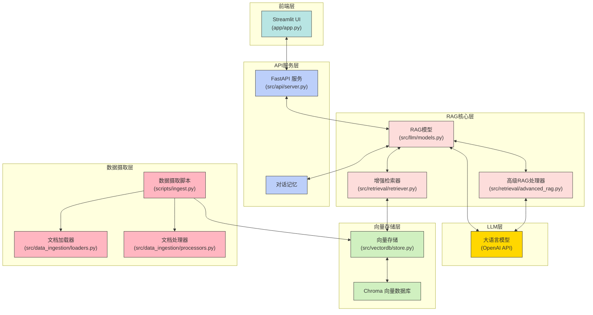
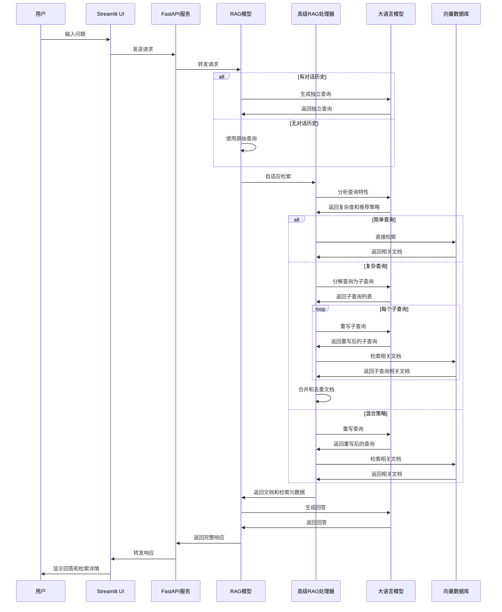
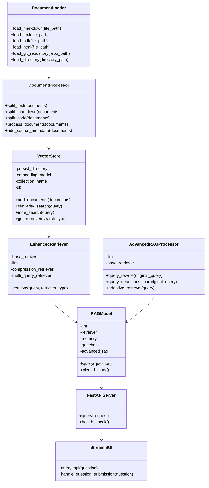

TODO

### 架构总览

```mermaid
graph TD
    subgraph "前端层"
        StreamlitUI["Streamlit UI\n(app/app.py)"]
    end
    
    subgraph "API服务层"
        FastAPI["FastAPI 服务\n(src/api/server.py)"]
        Memory["对话记忆"]
    end
    
    subgraph "RAG核心层"
        RAGModel["RAG模型\n(src/llm/models.py)"]
        AdvancedRAG["高级RAG处理器\n(src/retrieval/advanced_rag.py)"]
        EnhancedRetriever["增强检索器\n(src/retrieval/retriever.py)"]
    end
    
    subgraph "LLM层"
        LLM["大语言模型\n(OpenAI API)"]
    end
    
    subgraph "向量存储层"
        VectorStore["向量存储\n(src/vectordb/store.py)"]
        ChromaDB["Chroma 向量数据库"]
    end
    
    subgraph "数据摄取层"
        Loader["文档加载器\n(src/data_ingestion/loaders.py)"]
        Processor["文档处理器\n(src/data_ingestion/processors.py)"]
        IngestScript["数据摄取脚本\n(scripts/ingest.py)"]
    end
    
    StreamlitUI <--> FastAPI
    FastAPI <--> RAGModel
    RAGModel <--> Memory
    RAGModel <--> AdvancedRAG
    RAGModel <--> EnhancedRetriever
    RAGModel <--> LLM
    AdvancedRAG <--> LLM
    EnhancedRetriever <--> VectorStore
    VectorStore <--> ChromaDB
    
    IngestScript --> Loader
    IngestScript --> Processor
    IngestScript --> VectorStore
    
    classDef frontend fill:#B8E5E3,stroke:#333,stroke-width:1px;
    classDef api fill:#BCCFFA,stroke:#333,stroke-width:1px;
    classDef rag fill:#FDDDDB,stroke:#333,stroke-width:1px;
    classDef llm fill:#FFD700,stroke:#333,stroke-width:1px;
    classDef vector fill:#D0F0C0,stroke:#333,stroke-width:1px;
    classDef ingestion fill:#FFB6C1,stroke:#333,stroke-width:1px;
    
    class StreamlitUI frontend;
    class FastAPI,Memory api;
    class RAGModel,AdvancedRAG,EnhancedRetriever rag;
    class LLM llm;
    class VectorStore,ChromaDB vector;
    class Loader,Processor,IngestScript ingestion;
```

### 查询流程图

```mermaid
sequenceDiagram
    participant User as 用户
    participant UI as Streamlit UI
    participant API as FastAPI服务
    participant RAG as RAG模型
    participant AdvRAG as 高级RAG处理器
    participant LLM as 大语言模型
    participant VDB as 向量数据库
    
    User->>UI: 输入问题
    UI->>API: 发送请求
    API->>RAG: 转发请求
    
    alt 有对话历史
        RAG->>LLM: 生成独立查询
        LLM->>RAG: 返回独立查询
    else 无对话历史
        RAG->>RAG: 使用原始查询
    end
    
    RAG->>AdvRAG: 自适应检索
    
    AdvRAG->>LLM: 分析查询特性
    LLM->>AdvRAG: 返回复杂度和推荐策略
    
    alt 简单查询
        AdvRAG->>VDB: 直接检索
        VDB->>AdvRAG: 返回相关文档
    else 复杂查询
        AdvRAG->>LLM: 分解查询为子查询
        LLM->>AdvRAG: 返回子查询列表
        
        loop 每个子查询
            AdvRAG->>LLM: 重写子查询
            LLM->>AdvRAG: 返回重写后的子查询
            AdvRAG->>VDB: 检索相关文档
            VDB->>AdvRAG: 返回子查询相关文档
        end
        
        AdvRAG->>AdvRAG: 合并和去重文档
    else 混合策略
        AdvRAG->>LLM: 重写查询
        LLM->>AdvRAG: 返回重写后的查询
        AdvRAG->>VDB: 检索相关文档
        VDB->>AdvRAG: 返回相关文档
    end
    
    AdvRAG->>RAG: 返回文档和检索元数据
    RAG->>LLM: 生成回答
    LLM->>RAG: 返回回答
    RAG->>API: 返回完整响应
    API->>UI: 转发响应
    UI->>User: 显示回答和检索详情
```

### 类图

```mermaid
classDiagram
    class DocumentLoader {
        +load_markdown(file_path)
        +load_text(file_path)
        +load_pdf(file_path)
        +load_html(file_path)
        +load_git_repository(repo_path)
        +load_directory(directory_path)
    }
    
    class DocumentProcessor {
        +split_text(documents)
        +split_markdown(documents)
        +split_code(documents)
        +process_documents(documents)
        +add_source_metadata(documents)
    }
    
    class VectorStore {
        -persist_directory
        -embedding_model
        -collection_name
        -db
        +add_documents(documents)
        +similarity_search(query)
        +mmr_search(query)
        +get_retriever(search_type)
    }
    
    class EnhancedRetriever {
        -base_retriever
        -llm
        -compression_retriever
        -multi_query_retriever
        +retrieve(query, retriever_type)
    }
    
    class AdvancedRAGProcessor {
        -llm
        -base_retriever
        +query_rewrite(original_query)
        +query_decomposition(original_query)
        +adaptive_retrieval(query)
    }
    
    class RAGModel {
        -llm
        -retriever
        -memory
        -qa_chain
        -advanced_rag
        +query(question)
        +clear_history()
    }
    
    class FastAPIServer {
        +query(request)
        +health_check()
    }
    
    class StreamlitUI {
        +query_api(question)
        +handle_question_submission(question)
    }
    
    DocumentLoader ..> DocumentProcessor
    DocumentProcessor ..> VectorStore
    VectorStore ..> EnhancedRetriever
    EnhancedRetriever ..> RAGModel
    AdvancedRAGProcessor ..> RAGModel
    RAGModel ..> FastAPIServer
    FastAPIServer ..> StreamlitUI
```

